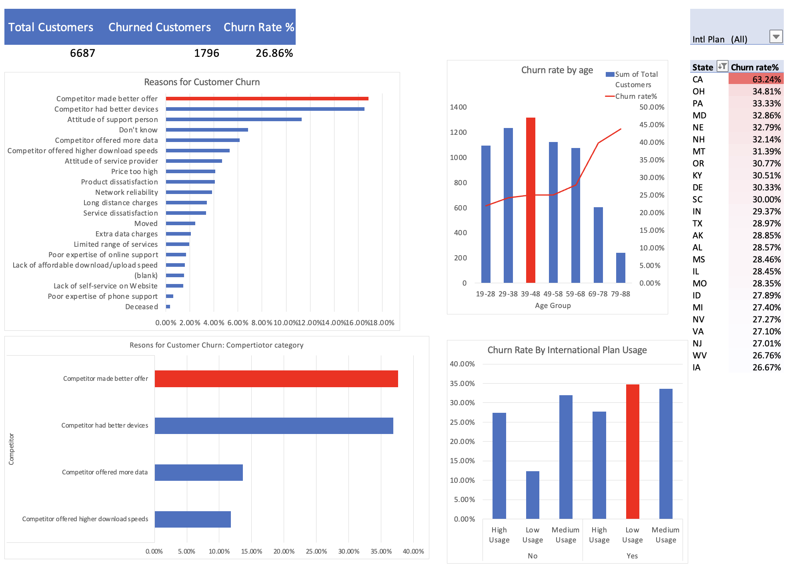

# Exel Projects

Welcome to my Excel Projects repository! This collection showcases various Excel projects I’ve worked on to demonstrate my expertise in data analysis, database design, and query optimization. Each project addresses real-world challenges and provides insightful solutions using Excel.

## Table of Contents

- [Overview](#overview)
- [Projects](#projects)
- [Technologies Used](#technologies-used)
- [Getting Started](#getting-started)
- [Contact](#contact)

---

## Overview

This repository features Excel worksheets and related files for portfolio projects I’ve completed. These projects span various industries and use cases, highlighting:

- Data Preparation  
- Data Visualization  
- Advanced Analytics  
- Customization  
- Integration and Sharing  

---

## Projects

### 1. [**Analyzing Customer Churn with Excel**](https://github.com/nalapalu/Excel_Projects/blob/main/Customer_Churn/Customer_churn.xlsx)

#### Objectives:
This project uses Excel to analyze customer churn for a telecom company, Databel, aiming to uncover actionable insights about customer behavior. Understanding churn goes beyond measuring the churn rate; it involves identifying root causes and crafting strategies to reduce customer attrition.

By leveraging Tableau's advanced features—such as calculated fields, dual-axis graphs, scatter plots, filters, and parameters—this analysis turns raw data into impactful, visually compelling dashboards.

#### Data:
The dataset contains information on customers (e.g., age, contract type, group plan) and their usage statistics (e.g., GB used, length of contract) from the fictional company Databel. The dataset (CSV files) was sourced from Datacamp.

#### Methods:
- Imported data into Excel, performed cleaning, and checked for duplicates and missing values.  
- Created new calculated fields and parameters.  
- Visualized data in dashboards using heatmaps, scatter plots, column charts, and dual-axis graphs.  
- Included interactive filters and parameters to facilitate analysis.  

The final story provides stakeholders with an intuitive and comprehensive view of plots, figures, and text fields to support better business decisions.


#### Results & Insights:



- The total churn rate is 26.86%, with competitors offering better deals as the primary cause.  
- California shows the highest churn rate, particularly among customers with month-to-month contracts.  
- Older customers are more likely to churn, while younger individuals and those in family/group plans exhibit lower rates.  
- Customers often churn due to underutilized plans, leading to higher perceived costs.  

---

## Technologies Used

- **Tools:** Excel

---

## Getting Started

1. Clone the repository to your local machine:  
   ```bash
   git clone https://github.com/nalapalu/Excel_Projects
   ```

2. Explore the project folders to access files, scripts, and documentation.

---

## Contact

If you have questions, feedback, or opportunities you’d like to discuss, feel free to reach out:

- **Email:** [chiran.nalapalu@gmail.com](mailto:chiran.nalapalu@gmail.com)  
- **LinkedIn:** [nalapalu](https://www.linkedin.com/in/nalapalu/)  

Let’s connect!

---

Thank you for reviewing my Excel portfolio! I hope these projects highlight my skills and enthusiasm for working with data.

---

I've maintained the structure while ensuring clarity and professionalism. Let me know if there's anything else you'd like to adjust!
